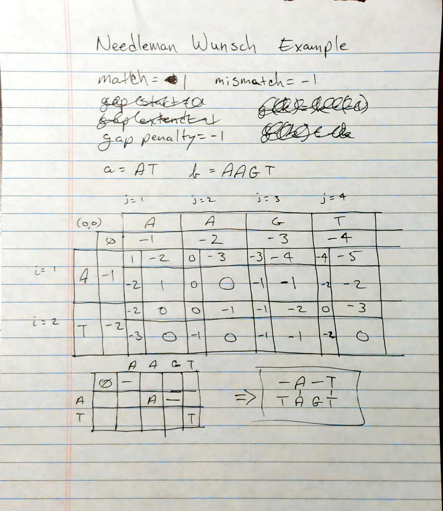
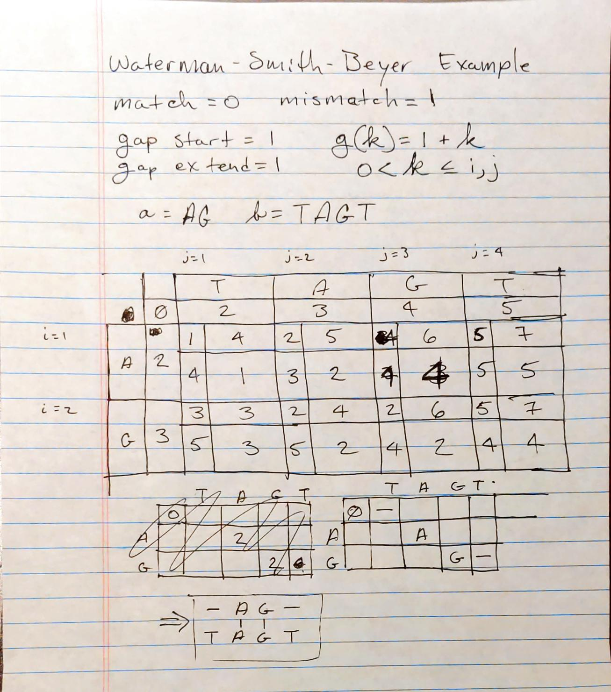
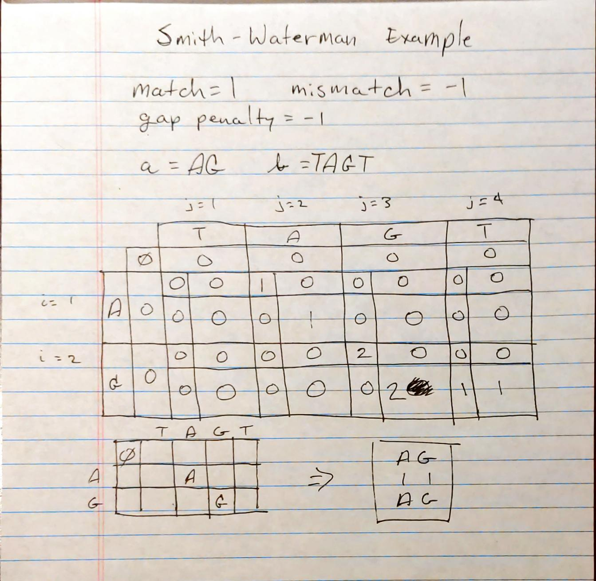

.. BINF690 documentation master file, created by
   sphinx-quickstart on Sun Sep 20 06:58:03 2020.
   You can adapt this file completely to your liking, but it should at least
   contain the root `toctree` directive.

BINF730 Biological Sequence Analysis
====================================

| Alexander Smith
| School of Systems Biology
| George Mason University
| Fall 2021

Pairwise Sequence Alignment
===========================

All source code and documentation can be found here:
https://github.com/ajsmith/sequence-analysis

Examples By Hand
================

Below are small examples by hand using Needleman-Wunsch,
Waterman-Smith-Beyer, and Smith-Waterman.

Programmatic Examples
=====================

Implementations of Needleman-Wunsch and Waterman-Smith-Beyer
algorithms are provided. Below are code examples and program output
which demonstrates their behavior.

Needleman-Wunsch
----------------

The `nw_align()` function aligns a pair of sequences using
Needleman-Wunsch by similarity.

    >>> from coolseq.align.pairwise import nw_align, print_alignment
    >>> nw_options = {
    ...     'match': 1,
    ...     'mismatch': -1,
    ...     'gap_extend': -1,
    ... }
    >>> result = nw_align('at', 'aagt', nw_options)
    >>> print_alignment(result)
    a--t
    |  |
    aagt
    >>> result = nw_align('gattaca', 'gcatgcu', nw_options)
    >>> print_alignment(result)
    g-attaca
    | ||  |
    gcatg-cu
    >>> result = nw_align('atgc', 'attgagc', nw_options)
    >>> print_alignment(result)
    at-g--c
    || |  |
    attgagc

Now we adjust the scoring options and re-run the alignments.

    >>> nw_options = {
    ...     'match': 1,
    ...     'mismatch': -10,
    ...     'gap_extend': -5,
    ... }
    >>> result = nw_align('at', 'aagt', nw_options)
    >>> print_alignment(result)
    a--t
    |  |
    aagt
    >>> result = nw_align('gattaca', 'gcatgcu', nw_options)
    >>> print_alignment(result)
    g-atta-ca-
    | ||   |
    gcat--gc-u
    >>> result = nw_align('atgc', 'attgagc', nw_options)
    >>> print_alignment(result)
    at-g--c
    || |  |
    attgagc

Change the options again.

    >>> nw_options = {
    ...     'match': 10,
    ...     'mismatch': -2,
    ...     'gap_extend': -10,
    ... }
    >>> result = nw_align('at', 'aagt', nw_options)
    >>> print_alignment(result)
    a--t
    |  |
    aagt
    >>> result = nw_align('gattaca', 'gcatgcu', nw_options)
    >>> print_alignment(result)
    gattaca
    |  | |
    gcatgcu
    >>> result = nw_align('atgc', 'attgagc', nw_options)
    >>> print_alignment(result)
    at-g--c
    || |  |
    attgagc

Waterman-Smith-Beyer
--------------------

The `wsb_align()` function aligns a pair of sequences using
Waterman-Smith-Beyer by distance.

    >>> from coolseq.align.pairwise import wsb_align
    >>> wsb_options = {
    ...     'match': 0,
    ...     'mismatch': 1,
    ...     'gap_start': 1,
    ...     'gap_extend': 1,
    ... }
    >>> result = wsb_align('at', 'aagt', wsb_options)
    >>> print_alignment(result)
    a--t
    |  |
    aagt
    >>> result = wsb_align('gattaca', 'gcatgcu', wsb_options)
    >>> print_alignment(result)
    gattaca
    |  | |
    gcatgcu
    >>> result = wsb_align('atgc', 'attgagc', wsb_options)
    >>> print_alignment(result)
    at---gc
    ||   ||
    attgagc

With different scoring options.

    >>> wsb_options = {
    ...     'match': 0,
    ...     'mismatch': 5,
    ...     'gap_start': 10,
    ...     'gap_extend': 3,
    ... }
    >>> result = wsb_align('at', 'aagt', wsb_options)
    >>> print_alignment(result)
    a--t
    |  |
    aagt
    >>> result = wsb_align('gattaca', 'gcatgcu', wsb_options)
    >>> print_alignment(result)
    gattaca
    |  | |
    gcatgcu
    >>> result = wsb_align('atgc', 'attgagc', wsb_options)
    >>> print_alignment(result)
    at---gc
    ||   ||
    attgagc

Change the options again.

    >>> wsb_options = {
    ...     'match': 0,
    ...     'mismatch': 10,
    ...     'gap_start': 2,
    ...     'gap_extend': 5,
    ... }
    >>> result = wsb_align('at', 'aagt', wsb_options)
    >>> print_alignment(result)
    a--t
    |  |
    aagt
    >>> result = wsb_align('gattaca', 'gcatgcu', wsb_options)
    >>> print_alignment(result)
    g-attaca
    | ||  |
    gcatg-cu
    >>> result = wsb_align('atgc', 'attgagc', wsb_options)
    >>> print_alignment(result)
    at---gc
    ||   ||
    attgagc

Demonstration With NCBI Sequences
=================================

Ribosomal RNA from saccharomyces cerevisiae (yeast) and drosophila
melanogaster (fruit fly) were chosen for samples.

..  literalinclude:: ../../src/coolseq/align/samples.fasta
    :caption: Sample Sequences

EMBOSS Needle on Fedora Linux was used to produce an alignment to
compare against.

Needle command::

    $ needle -asequence scere.fasta -bsequence dmela.fasta -outfile result.needle
    Needleman-Wunsch global alignment of two sequences
    Gap opening penalty [10.0]: 10.0
    Gap extension penalty [0.5]: 0.5

Which produced the following alignment:

..  literalinclude:: result.needle
    :caption: EMBOSS Needle Result

The following code examples demonstrates the alignment algorithms
provided by this project.

1. Load the samples

    >>> from Bio import SeqIO
    >>> from pkg_resources import resource_filename
    >>> file_path = resource_filename('coolseq', 'align/samples.fasta')
    >>> sample1, sample2 = list(SeqIO.parse(file_path, 'fasta'))
    >>> print(sample1.description)
    D25212.1 Saccharomyces cerevisiae gene for 26S rRNA, partial sequence, strain: IFO 2376
    >>> print(sample2.description)
    AY319386.1 Drosophila melanogaster 28S ribosomal RNA, partial sequence

2. Align samples using Needleman-Wunsch

    >>> nw_options = {
    ...     'mismatch': -10,
    ...     'gap_extend': -2,
    ... }
    >>> result = nw_align(sample1.seq, sample2.seq, nw_options)
    >>> print_alignment(result)
    ACTTG-G--ATAT--GGATT---C--TTCACGG---TAA--C-----GT--A-ACTG--AA-TGTGGAGACG
     |  | |  | |   | |     |  |||| |    |||  |     ||  | | ||  || |||| |||
    -C--GAGCGA-A-AAG-A--AAACAGTTCA-G-CACTAAGTCACTTTGTCTATA-TGGCAAATGTG-AGA--
    <BLANKLINE>
    TCGGC-GC-G-AGCCCTGGGAG-G--AG-TTATCTTTTCT--TC-TT-A-ACAGC-TTATCACCCCGGAATT
    | | | |  | |    ||| || |  |  | || |   ||  |  |  | | |   |||  ||   | | ||
    T-G-CAG-TGTA----TGG-AGCGTCA-AT-AT-T---CTAGT-AT-GAGA-A--ATTA--AC---G-A-TT
    <BLANKLINE>
    GGTTTA--TCCGGAGATGGGGTCTTATGGCTGGAA-GAGGCCAGCACCTTTG-C---T-G-GCTCCGGTGCG
      |  |  |||     |    |||||       || |||||||     |||  |   | | |    |||||
    --T--AAGTCC-----T----TCTTA-------AATGAGGCCA-----TTT-ACCCATAGAG----GGTGC-
    <BLANKLINE>
    CTTGTGACGGCCCGTGAAAATCCACA-GG--AA-GGA--A-TAG-T--T-TT-C-AT--GCTAG--GT----
    |     | ||||||| |   |  | | |   || | |  | ||| |  | || | |   |  ||  ||
    C-----A-GGCCCGT-A---T--A-ACG-TTAATG-ATTACTAGATGATGTTTCCA-AAG--AGTCGTGTTG
    <BLANKLINE>
    C--G-TAC-T-
    |  | ||| |
    CTTGATACGTG

3. Align samples using Waterman-Smith-Beyer

    >>> wsb_options = {
    ...     'match': 0,
    ...     'mismatch': 10,
    ...     'gap_start': 5,
    ...     'gap_extend': 2,
    ... }
    >>> result = wsb_align(sample1.seq, sample2.seq, wsb_options)
    >>> print_alignment(result)
    --------------------------------ACTTGG---ATATGGATTCTTCACGGTAACGTAACTGAAT
                                    |||| |   ||||||      ||              |||
    CGAGCGAAAAGAAAACAGTTCAGCACTAAGTCACTTTGTCTATATGG------CA--------------AAT
    <BLANKLINE>
    GTGGAGACGTCGGCGCGAGCCCTG---GGAGGAGTTATC-TTTTC----TTCTTAACAGCTTATCACCCCG-
    ||| |||  |    || ||   ||   ||||       |    ||    ||||    ||  |||      |
    GTG-AGA--T----GC-AG---TGTATGGAG-------CG---TCAATATTCT----AG--TAT------GA
    <BLANKLINE>
    GA-ATT---GGTTTA--TCCGGAGATGGGGTCTTATGGCTGGAA-GAGGCCAGCACCTTTGCTGG-CTCC--
    || |||   | ||||  |||     |    |||||       || |||||||     |||      | ||
    GAAATTAACGATTTAAGTCC-----T----TCTTA-------AATGAGGCCA-----TTT-----AC-CCAT
    <BLANKLINE>
    ----GGTGCGCTTGTGAC-GGCCCGTGA--A----AATCCACAGGA-----AGGAAT-A-GTTTTCATGC-T
        |||||        | ||||||| |  |    |||      ||     ||  || | |||| ||
    AGAGGGTGC--------CAGGCCCGT-ATAACGTTAAT------GATTACTAG--ATGATGTTTCCA---A-
    <BLANKLINE>
    AG-GTCGT----------AC-T-
    || |||||          || |
    AGAGTCGTGTTGCTTGATACGTG

Observations
~~~~~~~~~~~~

EMBOSS Needle with default options produced an alignment with well
defined gaps and clear regions of high conservation.

The alignments produced by this project's Needleman-Wunsch function
looks more spread out and less clearly defined. The results from
Waterman-Smith-Beyer look very clearly defined and seem to be very
close to those of EMBOSS Needle. This may be due to the
Waterman-Smith-Beyer implementation having an affine gap function
while Needleman-Wunsch uses a linear gap penalty.

Source Code
===========

..  literalinclude:: ../../src/coolseq/align/pairwise.py
    :caption: src/coolseq/align/pairwise.py

References
==========

 1. Course materials & textbooks

 2. https://en.wikipedia.org/wiki/Needleman%E2%80%93Wunsch_algorithm

 3. https://en.wikipedia.org/wiki/Smith%E2%80%93Waterman_algorithm
